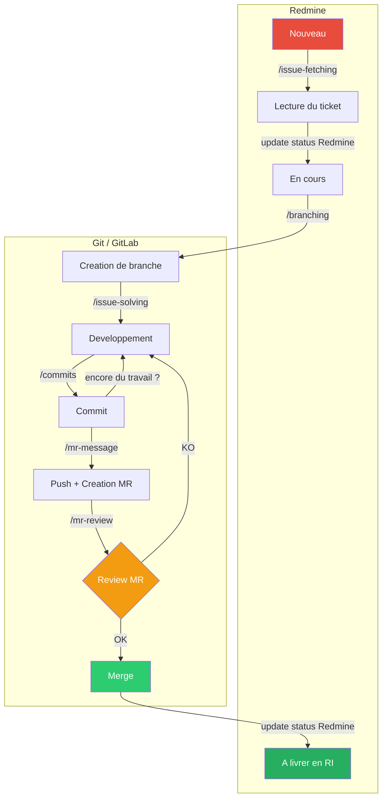

# Workflow de résolution d'un ticket

```mermaid
flowchart TD
    subgraph Redmine
        A["Nouveau"]
        B["Lecture du ticket"]
        C["En cours"]
        Z["A livrer en RI"]
    end

    subgraph Git / GitLab
        D["Creation de branche"]
        E["Developpement"]
        F["Commit"]
        G["Push + Creation MR"]
        H{"Review MR"}
        I["Merge"]
    end

    A -->|"/issue-fetching"| B
    B -->|"update status Redmine"| C
    C -->|"/branching"| D
    D -->|"/issue-solving"| E
    E -->|"/commits"| F
    F -->|"encore du travail ?"| E
    F -->|"/mr-message"| G
    G -->|"/mr-review"| H
    H -- "KO" --> E
    H -- "OK" --> I
    I -->|"update status Redmine"| Z

    style A fill:#e74c3c,color:#fff
    style Z fill:#27ae60,color:#fff
    style H fill:#f39c12,color:#fff
    style I fill:#2ecc71,color:#fff
```
